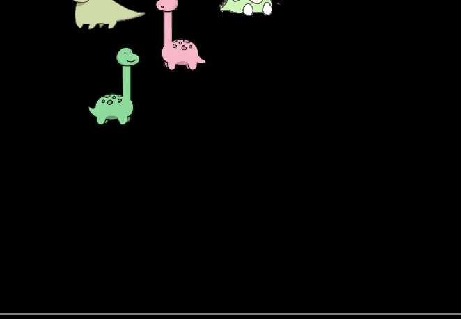

# Box2D Game

In this game, I used the Box2D engine to create several sprites that have
gravity, density, restitution, and friction. I also created a ground that has
box collision effects with the sprite.
